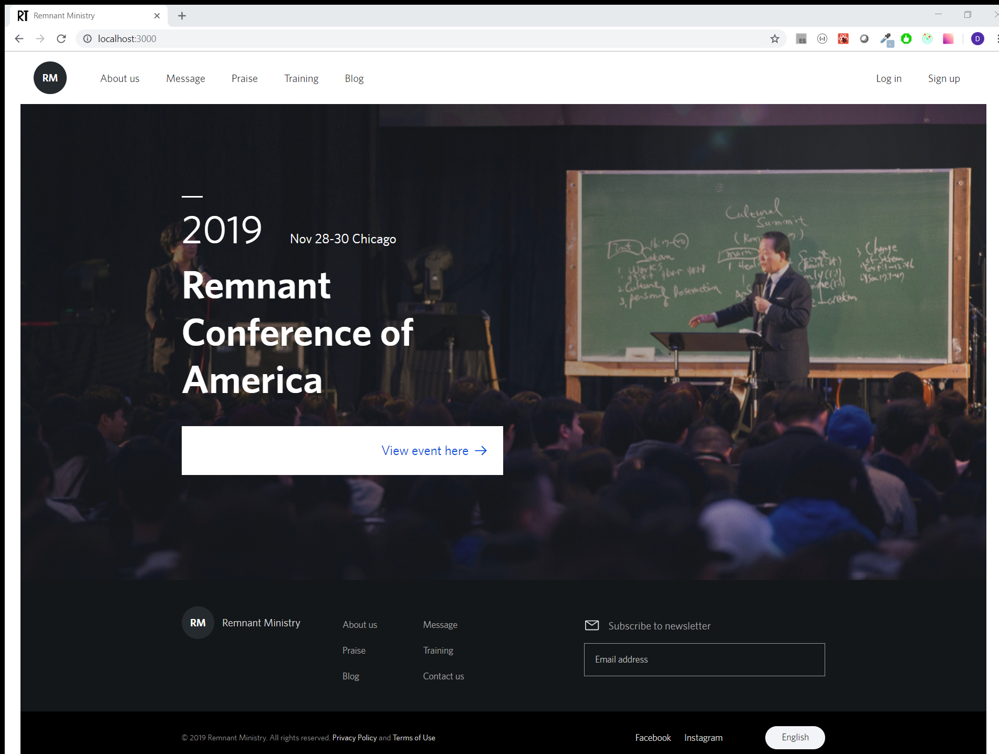
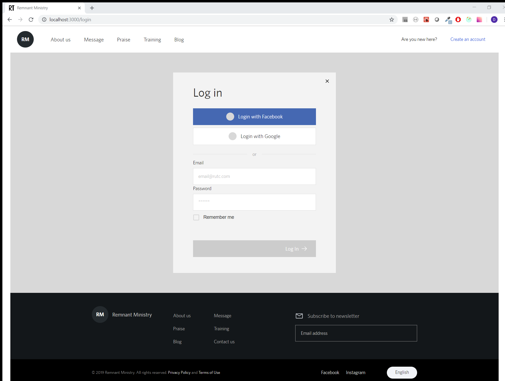
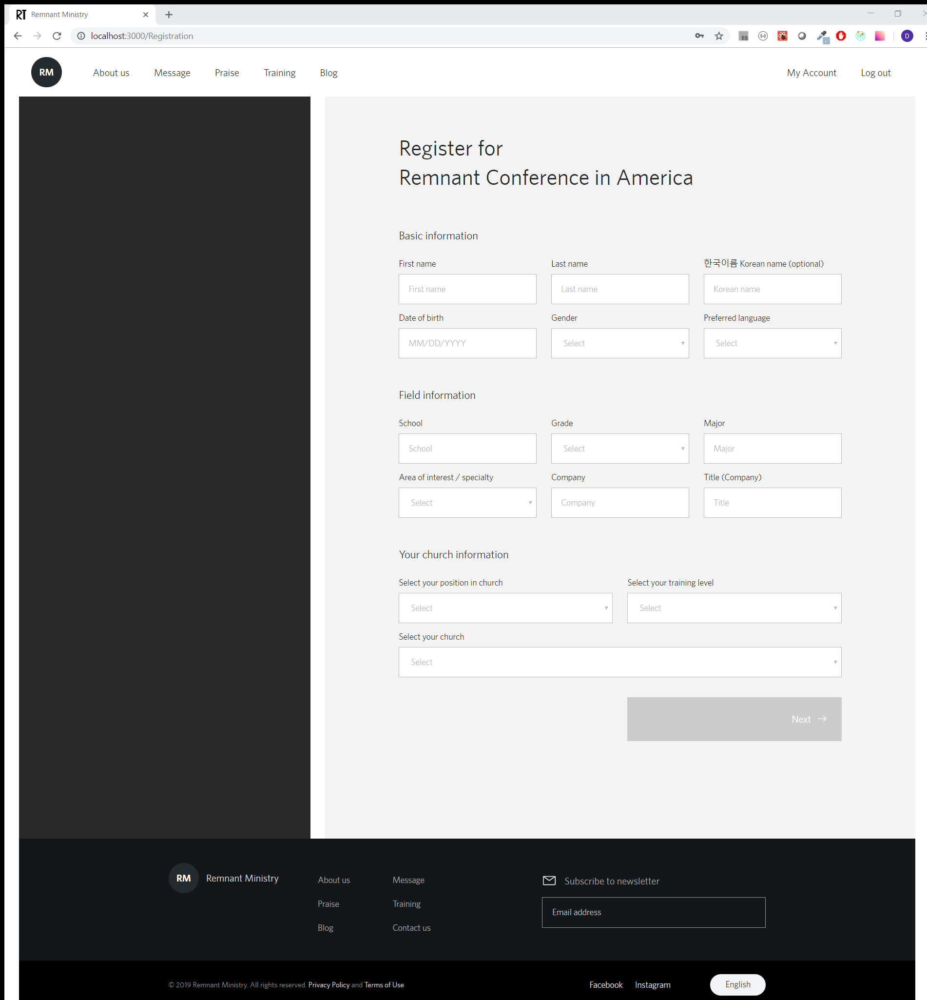
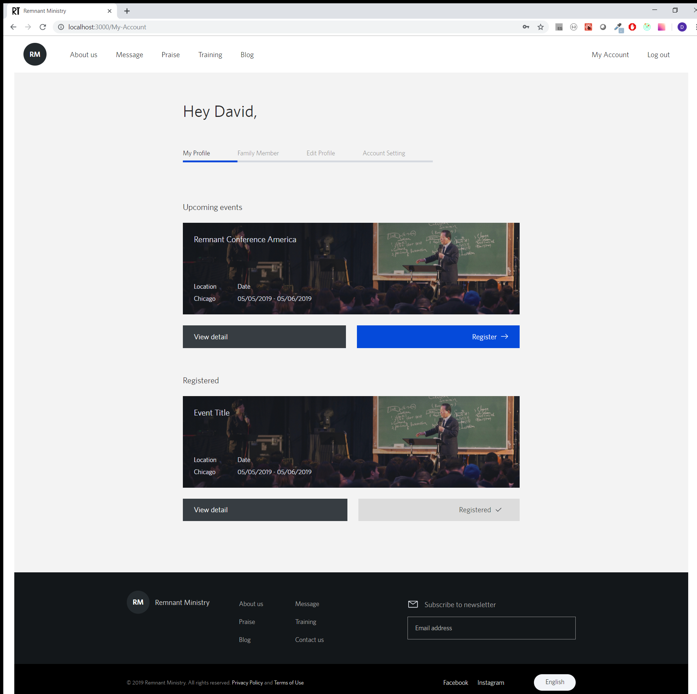

# Remnant Ministry

## Project Overview

- A web application for a Chrisitan organization (Darakbang)
- Users must sign up with email then log in gain full access
- When user is authenticated (temporarily using Firebase), user can view events(not yet designed) and register

## Start

```
npm install
```
then to start,
```
npm start
```

## Instructions
- Initial page
<!--  -->
  

- Login page / sign up if not registered
<!-- -  -->
  

- Log in to be allowed to register for upcoming events
<!-- -  -->
  

- When logged in, allows the user to edit the profile
<!-- -  -->
  

- More to come...

## Built with

- [React](https://github.com/facebook/react) - Front End library
- [Redux](https://redux.js.org/) - used to manage state
- [Material-UI](https://material-ui.com/) - Framework used to customize some input fields, select and checkboxes
- [React Router](https://github.com/ReactTraining/react-router) - Routing to navigate through different components

## Upcoming
1. User authentication - allow user to sign up, sign in with existing email and password
2. Registration pages
3. Event detail pages
4. Responsive design

### Collaboration

- **Jun Sung An** -_Design_ -[ZunAn](https://junsungan.com)
